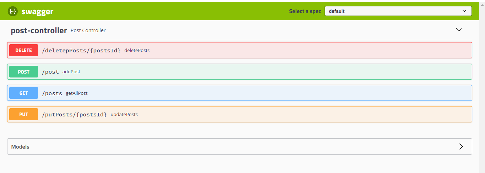

# CRUD-Ope-MongoAtlas-SwaggerUI
---
- Performed CURD Operation Using SpringBoot
- Used tools like,

     a) Intellij for code development.
     
     b) Swagger to perform end to end testing
     
     c) mongodb atlas to perform database operations
     
     d) Used github for the deployment
     
     ---
     
## What is Mongo Atlas?
MongoDB Atlas' document model enables developers to store data as JSON.
With MongoDB Atlas, use the tools and languages that you prefer.
With MongoDB Atlas, your database is secure by default with preconfigured security features built-in
     
### How to use Mongo Atlas ?
Step1: Go to the website of mongodb atlas type mongodb atlas in your browser or click on the below link 
(https://www.mongodb.com/cloud/atlas/lp/try4?utm_source=google&utm_campaign=search_gs_pl_evergreen_atlas_core_prosp-brand_gic-null_apac-in_ps-all_desktop_eng_lead&utm_term=atlas%20mongodb&utm_medium=cpc_paid_search&utm_ad=e&utm_ad_campaign_id=12212624347&adgroup=115749713263&gclid=CjwKCAjwvsqZBhAlEiwAqAHElcT6rUS0KxrhiP2laTBUeSSLnueCv7YiHCo-KF6afrX10M5f18kIqRoC_hQQAvD_BwE)

step2: Click on the Start here button

Step3: Create your account or login

Step4: Once you login, Click on Create Button

Step5: Once you click on the create button, the mongodb atlas allows you to create cluster. The below following pictures are shown to create cluster.

Step6: Select which cloud you want

Step7: Select the Region you wish, i have selected Mumbai which shows in the below picture

Step8: Keep the Cluster Tier, Additional Settings as it is, and set the Cluster Name One time only: once your cluster is created, you won't be able to change its name 

Step9: Click on Browser Collections

Step10: Once you click on the Browse Collection the left hand side you will find create database option

Step11: Click on create database option, and create your database with the name and collection.

Step12: Click on Insert Document and add the below JOSON data

#### [
{

"id": "1",

"desc": "Software Engineer who can work on enterprise projects using spring boot and mongodb",

"exp": 1,

"profiles": "developer",

"techs": [
"Java",
"J2ee",
"Spring",
"Spring Boot",
"Micro service"
],

"location": "Hyderabad/Secunderabad, Bangalore/Bengaluru"

},

---

{

"id": "2",

"desc": "Senior Software Engineer who expert knowledge in core java and concurrency",

"exp": 5,

"profiles": "Java Developer",

"techs": [
"Java",
"J2ee",
"Spring",
"Spring Boot",
"Micro service",
"Threads"
],

"location": "Hyderabad/Secunderabad, Bangalore/Bengaluru"

},

---

{

"id": "3",

"desc": "Associate consultant architecture of software, Agile, Devops",

"exp": 10,

"profiles": "Architech",

"techs": [
"Java",
"J2ee",
"Spring",
"Spring Boot",
"Micro service",
"AWS",
"Azure",
"Devops"
],

"location": "Hyderabad/Secunderabad, Bangalore/Bengaluru"

},

---

{

"id": "4",

"desc": "Senior Associate consultant for Mumbai Location",

"exp": 15,

"profiles": "Senior Architech",

"techs": [
"Java",
"J2ee",
"Spring",
"Spring Boot",
"Micro service",
"AWS",
"Azure",
"Devops"
],

"location": "Hyderabad/Secunderabad, Bangalore/Bengaluru"

},

---

{

"id": "5",

"desc": "Microservices developers",

"exp": 7,

"profiles": "Microservices developers",

"techs": [
"Java",
"J2ee",
"Spring",
"Spring Boot",
"Micro service"
],

"location": "Hyderabad/Secunderabad, Bangalore/Bengaluru"

},

---

{

"id": "6",

"desc": "Java Full Stack Developer",

"exp": 5,

"profiles": Microservices developers",

"techs": [
"Java",
"J2ee",
"Spring",
"Spring Boot",
"Micro service",
"Angular",
"Spring Security"
],

"location": "Hyderabad/Secunderabad, Bangalore/Bengaluru"

},

---

{

"id": "7",

"desc": "Python Developer",

"exp": 4,

"profiles": "Python developers",

"techs": [
"Python",
"PyCharm",
"Github",
"Data Structure",
"OPPS",
"Design Pattern",
"Linux"
],

"location": "Gurgaon, Bangalore/Bengaluru"

},

---

{

"id": "8",

"desc": "Senior Backend Engineer - Java/J2EE",

"exp": 7,

"profiles": "Senior Backend Engineer - Java/J2EE",

"techs": [
"Java",
"J2EE",
"Github",
"Data Structure",
"OPPS",
"Design Pattern",
"Linux",
"JWT"
],

"location": "Gurgaon, Bangalore/Bengaluru"

},

---

{

"id": "9",

"desc": "Senior Java Full Stack Developer",

"exp": 2,

"profiles": "Senior Java Full Stack Developer",

"techs": [
"Java",
"J2EE",
"Github",
"Data Structure",
"OPPS",
"Design Pattern",
"Linux",
"JWT",
"Agile"
],

"location": "Mumbai, Bangalore/Bengaluru"

},

---

{

"id": "10",

"desc": "React Js NodeJs Developer",

"exp": 5,

"profiles": "React Js NodeJs Developerr",

"techs": [
"Java",
"REACT",
"Github",
"Data Structure",
"OPPS",
"Design Pattern",
"Linux",
"Nodejs",
"Agile",
"Microsoft SQL Server",
"Mongo"
],

"location": "Chennai, Bangalore/Bengaluru"

},

---

{

"id": "11",

"desc": "Go Lang Developer",

"exp": 10,

"profiles": "Looking for Go Lang Developer",

"techs": [
"Go, Python, Ruby"
],

"location": "Bangalore"

},

---

{

"id": "6333d80bbe342444d5d5ebfa",

"desc": "Software Engineer who can work on enterprise projects using spring boot and mongodb",

"exp": 1,

"profiles": "developer",

"techs": [
"Java",
"J2ee",
"Spring",
"Spring Boot",
"Micro service"
],

"location": "Hyderabad/Secunderabad, Bangalore/Bengaluru"

}

### Finally after developing the project the Swagger Ui looks like below.

Thanks